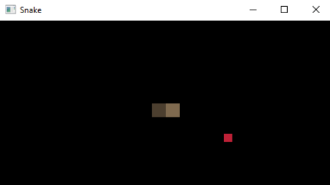
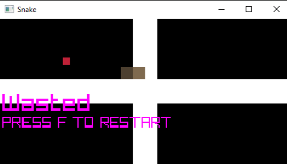
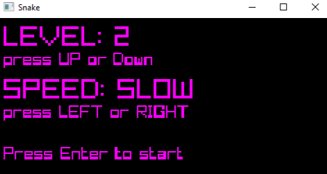
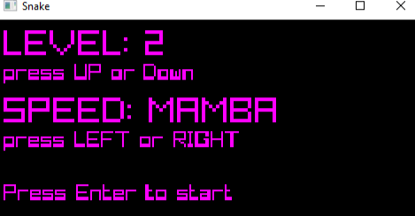

<h1>Snake Game</h1>

 

<h2>Описание</h2>

Это простая реализация классической игры "Змейка" с использованием библиотеки <a href="https://www.raylib.com/">raylib</a>. Игра поддерживает несколько уровней сложности и различные уровни игры.

<h2>Технологии</h2>
<ul>
    <li><strong>Язык программирования:</strong> C</li>
    <li><strong>Библиотека:</strong> <a href="https://www.raylib.com/">raylib</a></li>
    <li><strong>Сборка:</strong> CMake</li>
</ul>

<h2>Установка и запуск</h2>
<h3>Требования</h3>
<ul>
    <li>CMake 3.10 или выше</li>
    <li>Компилятор C (например, GCC или Clang)</li>
    <li>raylib (автоматически скачивается и устанавливается через CMake)</li>
</ul>

<h3>Инструкции по установке</h3>
<ol>
    <li>Клонируйте репозиторий:</li>
    <pre><code>git clone https://github.com/BogdanPryadko4853/snake.git
cd ваш-репозиторий</code></pre>
    <li>Создайте директорию для сборки и перейдите в нее:</li>
    <pre><code>mkdir build
cd build</code></pre>
    <li>Сгенерируйте файлы сборки с помощью CMake:</li>
    <pre><code>cmake ..</code></pre>
    <li>Соберите проект:</li>
    <pre><code>make</code></pre>
    <li>Запустите игру:</li>
    <pre><code>./snake</code></pre>
</ol>

<h2>Примеры игры</h2>
 
 
 
 

<h2>Управление</h2>
<ul>
    <li><strong>Стрелки</strong> или <strong>WASD</strong> для управления змейкой.</li>
    <li><strong>Enter</strong> для начала игры или выбора уровня.</li>
    <li><strong>R</strong> для перезапуска уровня.</li>
    <li><strong>F</strong> для перезапуска игры после проигрыша.</li>
</ul>

<h2>Структура проекта</h2>
<pre><code>snake-game/
├── CMakeLists.txt
├── README.md
├── main.c
├── snake.c
└── snake.h</code></pre>

